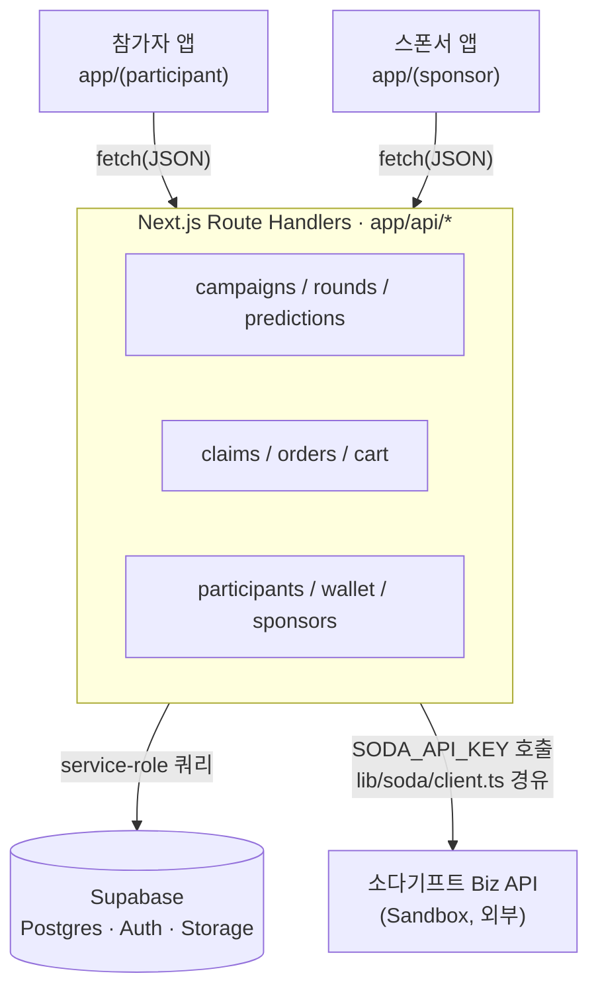
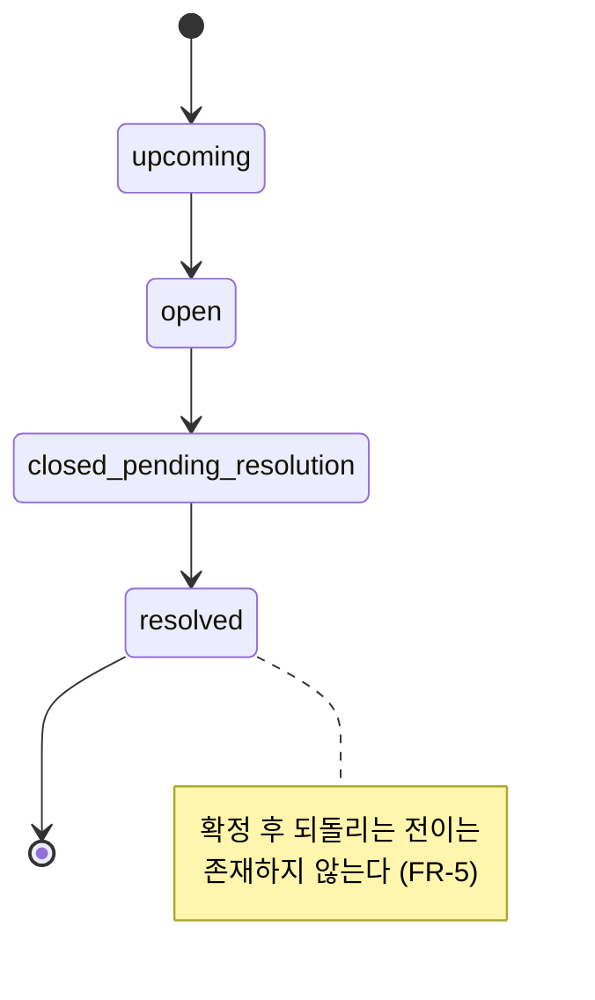

# SodaPick

2026 SCKG 해커톤 프로젝트. 엔터사·브랜드가 K팝 컴백에 맞춰 예측 캠페인을 열고, 정답을 맞힌 팬에게 소다기프트 상품권·크레딧을 실제로 지급하는 서비스.

## 무엇을 만들었나

컴백 시즌마다 반복되는 문제 하나를 겨냥했다: 팬 예측 이벤트는 흔하지만, 당첨자에게 국가별로 다른 경품을 실제로 보내는 과정은 대부분 수기 작업으로 남아 있다. SodaPick은 이 과정을 하나의 플랫폼으로 묶는다.

- **스폰서**는 캠페인 마법사로 라운드(주차별 질문)와 리워드를 설계하고, 예산 게이트를 통과해야 발행할 수 있다.
- **참가자**는 라운드마다 예측을 제출하고, 판정이 확정되면 리워드 상품을 골라 실제 배송/발송을 받는다.
- 지급은 소다기프트 Biz API(Sandbox)로 실제 주문이 나가는 구조이고, 판정 확정과 중복 지급 방지는 서버와 DB 제약 양쪽에서 강제한다.

## 아키텍처



두 앱은 같은 Next.js 프로젝트 안에서 라우트 그룹으로만 나뉘고, 데이터 접근은 전부 `app/api/*` Route Handler를 거친다. 그 아래로 내부 인프라(Supabase)와 외부 서비스(소다기프트 API)가 분리돼 있다.

| 계층 | 구성 | 비고 |
|---|---|---|
| 클라이언트 | `app/(participant)`, `app/(sponsor)` | 참가자 앱은 모바일 우선, 스폰서 앱은 데스크탑 우선 |
| API | `app/api/*` Route Handler | `zod`로 요청 검증, 함수 주석에 PRD의 FR 번호를 남겨 리뷰 시 요구사항과 대조 |
| 데이터 | Supabase Postgres · Auth · Storage | 서비스 롤 클라이언트로만 접근, 상태값은 텍스트 enum 대신 `as const` 유니온 타입으로 관리 |
| 외부 연동 | 소다기프트 Biz API | 카탈로그 조회 · 주문 생성 · 잔액 확인. 응답은 그대로 흘려보내지 않고 우리 타입으로 매핑 |

**핵심 규칙**: `lib/soda/client.ts` 밖에서는 `SODA_API_KEY`를 절대 import하지 않는다. 소다기프트를 호출하려면 반드시 이 모듈을 거친다.

### 판정·지급 상태 머신



라운드가 `resolved`로 넘어가는 순간 `predictions.is_correct`가 일괄 계산되고, 정답자마다 `reward_claims`가 `eligible` 상태로 생성된다. 이후 상품 선택(`product_selected`) → 주문(`order_placed`) → 발송 완료(`fulfilled`)로 이어지고, 실패하면 동일한 `external_reference_id`로만 재시도할 수 있다(중복 지급 방지). 스키마 전체와 RLS 정책은 [`docs/architecture.md`](./docs/architecture.md) 참고.

## 기술 스택

| 영역 | 선택 |
|---|---|
| 프레임워크 | Next.js 14 (App Router) + TypeScript |
| 스타일 | Tailwind CSS |
| DB / Auth / Realtime | Supabase (Postgres) |
| 외부 API | 소다기프트 Biz API (Sandbox: `https://biz-sandbox-api.sodagift.com`) |
| 배포 | Vercel + Supabase Cloud |
| 검증 | Zod |

## 프로젝트 구조

```
app/
├─ (participant)/        # 참가자 앱 — campaigns, store, cart, my, claim, invite
├─ (sponsor)/             # 스폰서 앱 — dashboard, campaigns/new, rounds, payouts
├─ auth/callback/         # Google OAuth 콜백
└─ api/                   # Route Handler (campaigns, rounds, claims, cart, wallet, ...)
lib/
├─ supabase/              # 브라우저/서버 클라이언트
├─ soda/client.ts          # 소다기프트 API 호출의 유일한 통로
├─ types.ts                # DB 테이블 타입, 상태값 유니온
└─ budget.ts               # 예산 게이트 계산
supabase/
└─ migrations/            # 스키마 변경 이력 (순번대로 적용)
docs/
├─ architecture.md         # DB 스키마, 상태 머신, API 라우트, RLS
├─ stack.md                # 개발 참조용 컨벤션 정리
└─ SodaPick_*_PRD.md        # 참가자 앱 / 스폰서 앱 PRD
```

## 시작하기

```bash
npm install
npx supabase db push   # supabase/migrations 적용
npm run dev
```

`.env.local`:

```
NEXT_PUBLIC_SUPABASE_URL=
NEXT_PUBLIC_SUPABASE_ANON_KEY=
SUPABASE_SERVICE_ROLE_KEY=       # 서버 전용, 클라이언트 번들에 포함 금지
SODA_API_KEY=                    # 서버 전용
SODA_API_BASE_URL=https://biz-sandbox-api.sodagift.com
```

## 문서

- [`docs/architecture.md`](./docs/architecture.md) — DB 스키마, ERD, 상태 머신, 내부 API 라우트, 소다기프트 매핑, Realtime 채널
- [`docs/stack.md`](./docs/stack.md) — 코딩 컨벤션, 자주 쓰는 소다기프트 호출 예시
- [`docs/SodaPick_고객사앱_PRD.md`](./docs/SodaPick_고객사앱_PRD.md) — 스폰서 앱 PRD
- [`docs/SodaPick_유저앱_PRD.md`](./docs/SodaPick_유저앱_PRD.md) — 참가자 앱 PRD

## 브랜치 전략

기능 작업은 `develop`에 쌓고, `develop`을 `main`으로 PR로 병합한다. 커밋·PR 컨벤션은 [`CLAUDE.md`](./CLAUDE.md)에 정리돼 있다 (Conventional Commits, 한국어 개조식 서술).
