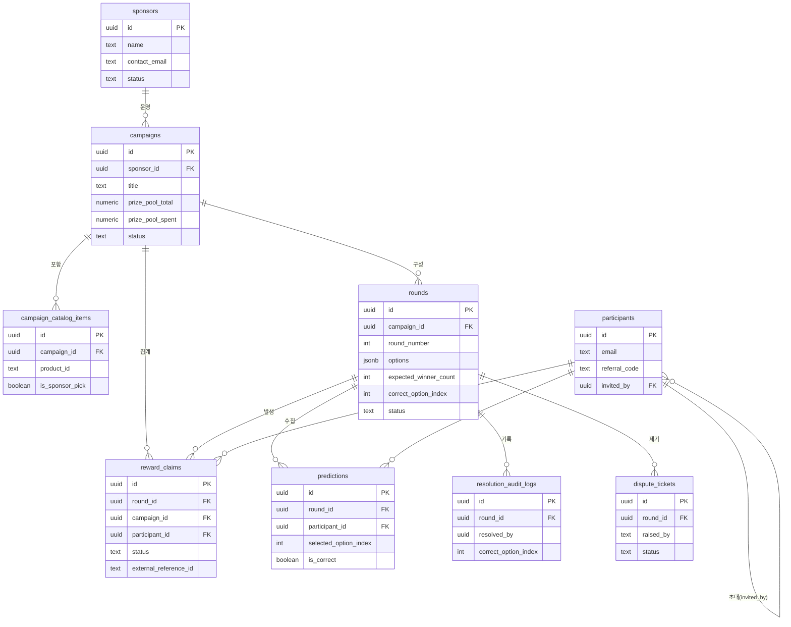

# 아키텍처.md — SodaPick 시스템 설계 참조

> 선택 이유는 `SodaPick_기술아키텍처.md` 참고. 이 문서는 스키마/라우트/상태머신을 그대로 코드로 옮길 수 있는 수준까지 구체화한 것.

## 1. 시스템 다이어그램

```
 참가자 브라우저                     스폰서 브라우저
      │                                  │
      ▼                                  ▼
 ┌─────────────────────────────────────────────┐
 │   Next.js App Router (app/(participant), app/(sponsor)) │
 ├─────────────────────────────────────────────┤
 │        Next.js API Route Handlers (app/api/*)  │
 │        ── SODA_API_KEY는 이 레이어 안에만 ──     │
 └───────────────┬───────────────┬───────────────┘
                 ▼               ▼
      ┌─────────────────┐  ┌─────────────────────┐
      │ Supabase Postgres│  │ SodaGift Biz API      │
      │ + Auth + Realtime│  │ (Sandbox)             │
      └─────────────────┘  └─────────────────────┘
```

## 2. DB 스키마 (Supabase / Postgres)

```sql
create table sponsors (
  id uuid primary key default gen_random_uuid(),
  name text not null,
  contact_email text not null,
  status text not null default 'active', -- active | suspended
  created_at timestamptz not null default now()
);

create table campaigns (
  id uuid primary key default gen_random_uuid(),
  sponsor_id uuid not null references sponsors(id),
  title text not null,
  artist_name text,
  prize_pool_total numeric not null default 0,
  prize_pool_spent numeric not null default 0,
  starts_at timestamptz,
  ends_at timestamptz,
  status text not null default 'draft', -- draft | active | ended
  mission_url text, -- 참여 전 방문해야 하는 사이트 (0002 마이그레이션, null이면 미션 없음)
  created_at timestamptz not null default now()
);

create table campaign_catalog_items (
  id uuid primary key default gen_random_uuid(),
  campaign_id uuid not null references campaigns(id),
  product_id text not null,          -- 소다기프트 GET /v1/products 의 id
  is_sponsor_pick boolean not null default false,
  unique (campaign_id, product_id)
);

create table rounds (
  id uuid primary key default gen_random_uuid(),
  campaign_id uuid not null references campaigns(id),
  round_number int not null,
  question_text text not null,
  options jsonb not null,             -- ["옵션1","옵션2","옵션3","옵션4"]
  resolution_criteria text,
  -- 보상 방식 (0002/0003 마이그레이션): 라운드마다 둘 중 하나
  --   PRODUCT: 카탈로그 상품 지급 (기존) — expected_winner_count 필수
  --   CREDIT : 라운드에 건 고정 풀 금액을 정답자 수로 나눠 갖는 배당형
  --            — credit_pool_amount/credit_currency 필수
  -- 둘 중 정확히 한쪽 필드셋만 채워지도록 rounds_reward_mode_fields_check로 강제.
  --
  -- CREDIT은 통화만 정한다(브랜드는 미리 고정 안 함) — 소다기프트엔 범용 현금이
  -- 없고 가변금액 상품권도 전부 브랜드 락인이라, 당첨자가 이 통화 안에서 원하는
  -- 브랜드를 클레임 확정(/api/claims/[id]/confirm) 시점에 직접 고른다.
  reward_mode text not null default 'PRODUCT' check (reward_mode in ('PRODUCT', 'CREDIT')),
  expected_winner_count int,          -- PRODUCT: 예산 게이트 계산용, 스폰서 직접 입력 (자동 계산 아님)
  credit_pool_amount numeric,         -- CREDIT: 라운드 풀 금액 (당첨자 수와 무관하게 고정 지출)
  credit_currency text,               -- CREDIT: 이 통화의 가변금액 상품권 중에서 당첨자가 고름
  correct_option_index int,           -- null until resolved
  opens_at timestamptz not null,
  closes_at timestamptz not null,
  resolved_at timestamptz,
  status text not null default 'upcoming',
    -- upcoming | open | closed_pending_resolution | resolved
  unique (campaign_id, round_number)
);

create table participants (
  id uuid primary key default gen_random_uuid(),
  email text not null unique,
  country text,
  referral_code text not null unique default substr(md5(random()::text), 1, 8),
  invited_by uuid references participants(id),
  created_at timestamptz not null default now()
);

create table predictions (
  id uuid primary key default gen_random_uuid(),
  round_id uuid not null references rounds(id),
  participant_id uuid not null references participants(id),
  selected_option_index int not null,
  submitted_at timestamptz not null default now(),
  is_correct boolean,                 -- resolve 시점에 일괄 채움
  unique (round_id, participant_id)   -- FR-3: 동일 참가자 재제출 방지
);

create table reward_claims (
  id uuid primary key default gen_random_uuid(),
  round_id uuid not null references rounds(id),
  campaign_id uuid not null references campaigns(id),
  participant_id uuid not null references participants(id),
  status text not null default 'eligible',
    -- eligible | product_selected | order_placed | fulfilled | failed
    -- CREDIT 모드는 상품 선택 단계가 없어 eligible을 거치지 않고 resolve 시점에
    -- 바로 order_placed/failed로 생성됨 (app/api/rounds/[id]/resolve/route.ts)
  selected_product_id text,
  payout_amount numeric,   -- CREDIT 모드: 정답자 수로 나눈 실수령액 (PRODUCT는 null)
  payout_currency text,    -- CREDIT 모드에서만 채워짐
  external_reference_id text not null unique,  -- FR-6: 중복지급 방지 (DB 레벨 방어)
    -- 영숫자만 허용(샌드박스 실호출로 확인, 하이픈·언더스코어 불가) — lib/soda/client.ts의
    -- buildExternalReferenceId()로만 생성한다
  soda_order_id text,
  soda_order_item_id text,
  created_at timestamptz not null default now(),
  updated_at timestamptz not null default now(),
  unique (round_id, participant_id)
);

create table resolution_audit_logs (
  id uuid primary key default gen_random_uuid(),
  round_id uuid not null references rounds(id),
  resolved_by uuid not null,           -- sponsor user id
  correct_option_index int not null,
  resolved_at timestamptz not null default now()
);
-- append-only 강제: update/delete 권한 부여하지 않음 (RLS로 차단)

create table mission_completions (
  id uuid primary key default gen_random_uuid(),
  campaign_id uuid not null references campaigns(id),
  participant_id uuid not null references participants(id),
  completed_at timestamptz not null default now(),
  unique (campaign_id, participant_id)
);
-- 예측 제출 API는 이 테이블에 완료 기록이 있는지 먼저 확인해야 한다
-- (mission_url이 null인 캠페인은 미션 자체가 없어 체크 스킵)

create table dispute_tickets (
  id uuid primary key default gen_random_uuid(),
  round_id uuid not null references rounds(id),
  raised_by text not null,
  reason text not null,
  status text not null default 'open', -- open | reviewing | closed
  created_at timestamptz not null default now()
);
```

**RLS 핵심 정책 (요지만)**
- `resolution_audit_logs`: INSERT만 허용, UPDATE/DELETE 정책 자체를 만들지 않음 → 판정 불변성을 DB 권한으로 강제.
- `rounds`: `correct_option_index` UPDATE는 `status = 'closed_pending_resolution'`일 때만 허용하는 정책 함수로 감싸고, 성공 시 트리거로 `status`를 `resolved`로 전환.
- `reward_claims.external_reference_id`는 UNIQUE 제약이 곧 중복지급 방지의 최후 방어선.

### 2.1 ERD



## 3. 상태 머신

```
Round.status:
  upcoming → open → closed_pending_resolution → resolved
  (resolved 이후 되돌리는 전이 자체가 존재하지 않음 — FR-5)

RewardClaim.status:
  eligible → product_selected → order_placed → fulfilled
                                          └──→ failed → (재시도) → order_placed
```

## 4. 내부 API 라우트

| 라우트 | 메서드 | 설명 | 비고 |
|---|---|---|---|
| `/api/campaigns` | POST | 캠페인 초안 생성 (`mission_url` 포함) | 스폰서 인증 필요(TODO) |
| `/api/campaigns/[id]` | PATCH | 초안 수정 | `status='draft'`일 때만 허용 |
| `/api/campaigns/[id]/rounds` | POST/GET | 라운드 생성/목록 | reward_mode(PRODUCT/CREDIT)에 따라 필수 필드 분기, 문서 표에 없던 라우트지만 마법사에 필요해 추가 |
| `/api/campaigns/[id]/catalog` | POST/GET | PRODUCT 모드 리워드 카탈로그 설정/조회 | 위와 동일한 이유로 추가 |
| `/api/campaigns/[id]/claims` | GET | 캠페인의 reward_claims 목록 | 지급 현황 화면(PRD 5.8)용, 단건 조회만 있던 걸 보강 |
| `/api/campaigns/[id]/missions/visit` | GET | 미션(사이트 방문) 완료 기록 + 리다이렉트 | `mission_completions` upsert 후 `mission_url`로 302 |
| `/api/campaigns/[id]/missions/status` | GET | 미션 완료 여부 확인 | 예측 제출 전 유저앱이 확인 |
| `/api/campaigns/[id]/budget-check` | GET | 예산 게이트 체크 | PRODUCT 라운드는 추정치(당첨자 수×평균단가), CREDIT 라운드는 풀 금액 그대로 합산 |
| `/api/campaigns/[id]/publish` | POST | 캠페인 발행 | budget-check 통과 못하면 400 |
| `/api/rounds/[id]/close` | POST | 라운드 마감(판정 대기로 전환) | 스케줄러 없어서 스폰서가 수동 전환(TODO: closes_at 기반 자동화) |
| `/api/rounds/[id]/resolve` | GET/POST | 판정 미리보기(FR-4) / 확정 | GET은 영향받는 참가자 수 미리보기. POST 성공 시 `predictions.is_correct` 일괄 계산 + `resolution_audit_logs` 기록 + `eligible` reward_claims 생성(PRODUCT/CREDIT 공통). **CREDIT 모드는 여기서 자동 주문하지 않는다** — `payout_amount`(풀 금액÷정답자 수)만 채워두고, 실제 브랜드 선택·주문은 참가자가 `/api/claims/[id]/confirm`에서 한다 |
| `/api/predictions` | POST | 예측 제출 | 미구현(유저앱 담당). `unique(round_id, participant_id)` 위반 시 409, 기존 선택 반환. mission_url이 있으면 `/missions/status` 먼저 확인해야 함 |
| `/api/products` | GET | 카탈로그 조회 프록시 | `GET /v1/products` 캐시(TTL 5분) |
| `/api/claims/[id]/confirm` | POST | 리워드 상품 확정 + 발송 | 원래 유저앱 담당으로 남겨둘 라우트였지만 CREDIT 모드가 이거 없이는 지급이 안 되는 구조라 구현함. body는 `{ product_id }` 하나뿐 — PRODUCT는 캠페인 카탈로그 안의 상품인지 검증 후 그대로 주문, CREDIT은 고른 상품이 `claim.payout_currency`와 같은 통화의 가변금액 상품권인지 검증 후 `custom_amount=claim.payout_amount`로 주문 |
| `/api/claims/[id]/status` | GET | 발송 상태 확인 | 서버가 `GET /v1/orders/{id}` 호출 후 DB 갱신 |
| `/api/claims/[id]/retry` | POST | 실패건 재시도 | 동일 `external_reference_id` + `claim.selected_product_id`(confirm이 주문 성공/실패와 무관하게 먼저 기록해둠)로 재호출, CREDIT은 `claim.payout_amount`도 같이 |

## 5. 소다기프트 외부 API 매핑

| 내부 라우트 | 외부 호출 | 캐시/빈도 |
|---|---|---|
| `/api/products` | `GET /v1/products` | 5분 TTL 캐시 |
| `/api/campaigns/[id]/budget-check` | `GET /v1/accounts/balance` | 캐시 없음, 게이트 진입 시마다 |
| `/api/claims/[id]/confirm` | `POST /v1/orders` | 캐시 없음, 클레임당 1회 (멱등키로 보호) |
| `/api/claims/[id]/status` | `GET /v1/orders/{id}` | 서버가 짧은 간격(예: 3초)으로 폴링, 완료되면 중단 |
| `/api/claims/[id]/retry` | `POST /v1/orders` (동일 참조ID) | 실패건 한정 |

**`POST /v1/orders` 실제 스펙 (샌드박스 실호출로 확인, 2026-08-29 — 문서화 안 된 부분)**
- 가변 금액권(고정 `amount`가 없고 `min_amount`~`max_amount` 범위인 상품)은 `item.id`와 함께
  `item.custom_amount`(스네이크케이스, 상품 통화 기준 숫자)를 반드시 같이 보내야 함. camelCase(`customAmount`)나
  top-level 필드로는 안 되고, 없으면 `"customAmount is required"` 400.
- `external_reference_id`는 **영숫자만 허용** — 하이픈·언더스코어 포함 시 400. UUID를 그대로 이어붙이면
  깨지므로 `lib/soda/client.ts`의 `buildExternalReferenceId()`로 하이픈을 제거해서 생성한다.
- 응답 구조가 생성(POST) 응답과 조회(GET) 응답이 서로 다름: POST는 `order_item`(단수 객체), GET은
  `order_items`(배열). `lib/soda/client.ts`가 둘 다 같은 `SodaOrder` 형태로 정규화해서 반환한다.
- 상품 통화와 계정 잔액 통화가 다르면 `total_price_charged`에 실제 환율 적용 후 청구액이 나온다(예:
  SGD 5 주문 시 계정에서 USD 3.98 차감). 샌드박스엔 USD 가변금액 상품권이 없어서(GBP/JPY/SGD만 존재),
  크레딧 배당 라운드는 대부분 환전이 발생함 — `lib/budget.ts`의 알려진 한계 참고.

## 6. Realtime 채널

| 채널 | 용도 | 구독 주체 |
|---|---|---|
| `predictions:round_id=eq.{id}` | 실시간 컨센서스 % 계산용 | 참가자 앱 (캠페인 상세 화면) |
| `reward_claims:campaign_id=eq.{id}` | 지급 현황 실시간 갱신 | 스폰서 앱 (지급 모니터링 화면) |

## 7. 인증

- 참가자: Supabase Auth 매직링크 (비밀번호 없음, `participants` 테이블과 `auth.users`를 email로 매칭)
- 스폰서: Supabase Auth 이메일+비밀번호 (내부 인원이라 매직링크 대신 일반 로그인으로 충분)
